

<picture><source media="(prefers-color-scheme: dark)" srcset="assets/dark/header-v1.svg"/>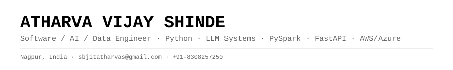</picture>

<a href="https://github.com/Atharva680"><picture><source media="(prefers-color-scheme: dark)" srcset="https://img.shields.io/badge/GITHUB-0d1117?style=flat-square&logo=github&logoColor=ffffff"/></picture></a>
<a href="https://linkedin.com/in/atharva-shinde7474"><picture><source media="(prefers-color-scheme: dark)" srcset="https://img.shields.io/badge/LINKEDIN-0d1117?style=flat-square&logo=linkedin&logoColor=ffffff"/></picture></a>
<a href="mailto:sbjitatharvas@gmail.com"><picture><source media="(prefers-color-scheme: dark)" srcset="https://img.shields.io/badge/EMAIL-0d1117?style=flat-square&logo=gmail&logoColor=ffffff"/></picture></a>
<a href="tel:+918308257250"><picture><source media="(prefers-color-scheme: dark)" srcset="https://img.shields.io/badge/PHONE-0d1117?style=flat-square"/></picture></a>

<picture><source media="(prefers-color-scheme: dark)" srcset="assets/dark/s01.svg"/>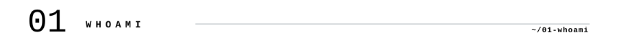</picture>
<picture><source media="(prefers-color-scheme: dark)" srcset="assets/dark/whoami.svg"/>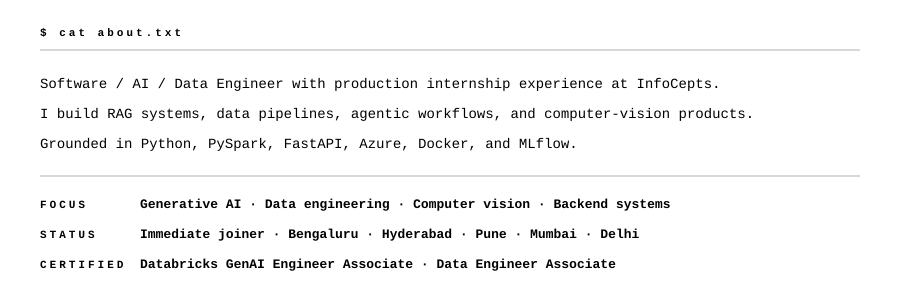</picture>
<picture><source media="(prefers-color-scheme: dark)" srcset="assets/dark/s02.svg"/>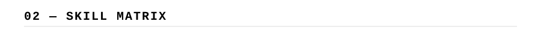</picture>
<picture><source media="(prefers-color-scheme: dark)" srcset="assets/dark/ecosystem.svg"/>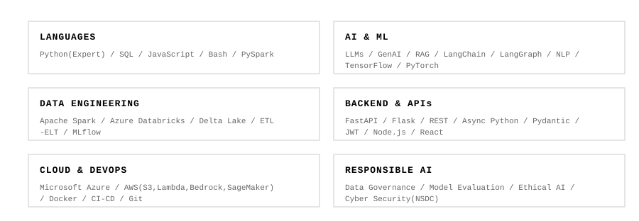</picture>
<picture><source media="(prefers-color-scheme: dark)" srcset="assets/dark/s03.svg"/>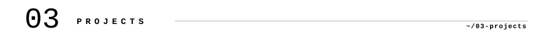</picture>
<picture><source media="(prefers-color-scheme: dark)" srcset="assets/dark/projects.svg"/>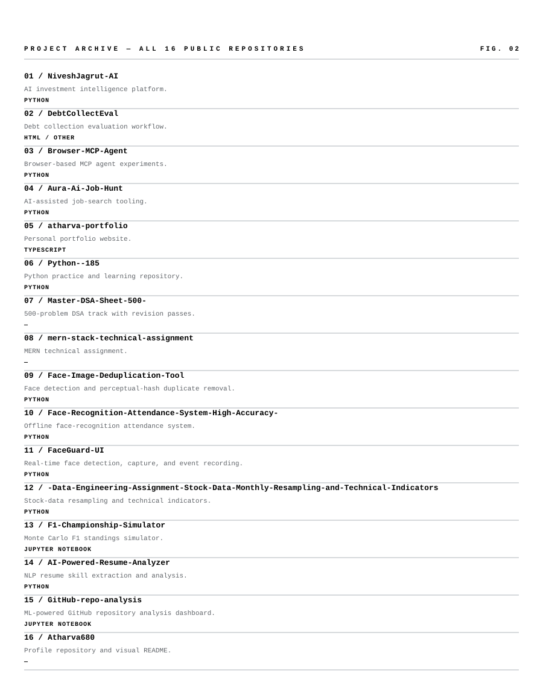</picture>
<picture><source media="(prefers-color-scheme: dark)" srcset="assets/dark/s04.svg"/>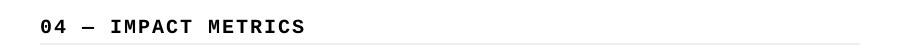</picture>
<picture><source media="(prefers-color-scheme: dark)" srcset="assets/dark/telemetry.svg"/>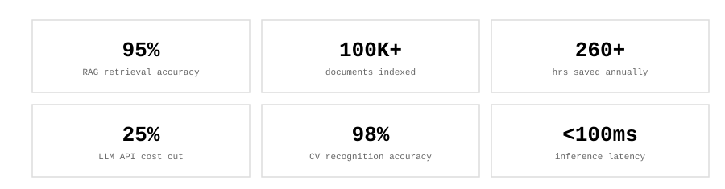</picture>

<picture><source media="(prefers-color-scheme: dark)" srcset="https://github-readme-stats.vercel.app/api?username=Atharva680&show_icons=true&bg_color=0d1117&text_color=ffffff&icon_color=ffffff&title_color=ffffff&border_color=30363d&hide_border=true"/></picture>
<picture><source media="(prefers-color-scheme: dark)" srcset="https://github-readme-stats.vercel.app/api/top-langs/?username=Atharva680&layout=compact&bg_color=0d1117&text_color=ffffff&title_color=ffffff&border_color=30363d&hide_border=true"/></picture>

<picture><source media="(prefers-color-scheme: dark)" srcset="https://github-readme-activity-graph.vercel.app/graph?username=Atharva680&bg_color=00000000&color=ffffff&line=ffffff&point=ffffff&area_color=ffffff&area=true&hide_border=true&radius=0&custom_title=CONTRIBUTION%20TELEMETRY"/></picture>

<picture><source media="(prefers-color-scheme: dark)" srcset="assets/dark/s05.svg"/></picture>
<picture><source media="(prefers-color-scheme: dark)" srcset="assets/dark/timeline.svg"/>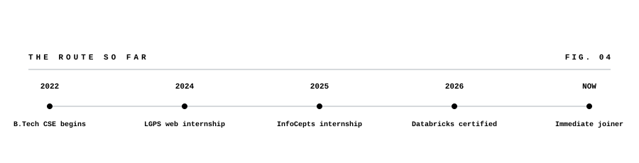</picture>
<picture><source media="(prefers-color-scheme: dark)" srcset="assets/dark/experience.svg"/>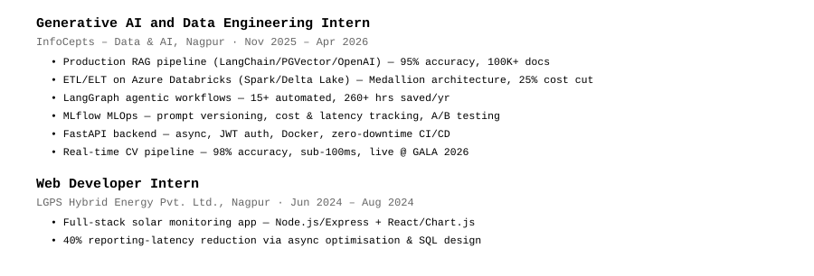</picture>
<picture><source media="(prefers-color-scheme: dark)" srcset="assets/dark/s06.svg"/>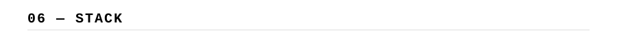</picture>
<picture><source media="(prefers-color-scheme: dark)" srcset="assets/dark/stack.svg"/></picture>
<picture><source media="(prefers-color-scheme: dark)" srcset="assets/dark/footer.svg"/>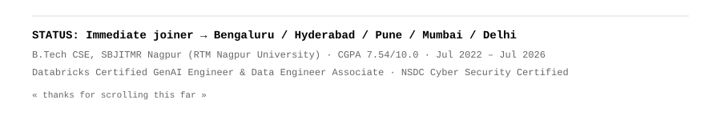</picture>

<!-- one responsive picture per visual; no duplicate light/dark rendering -->
